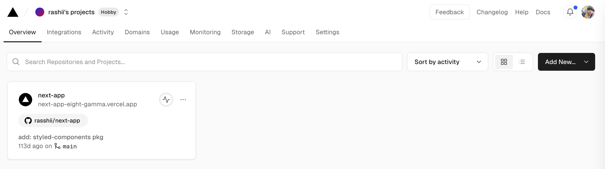
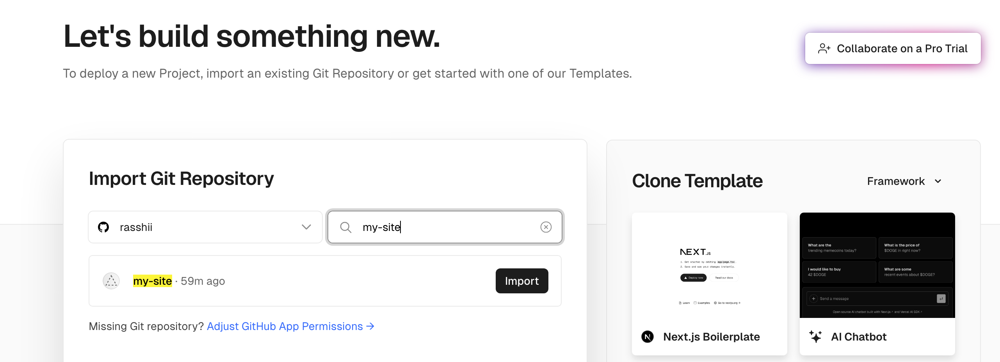
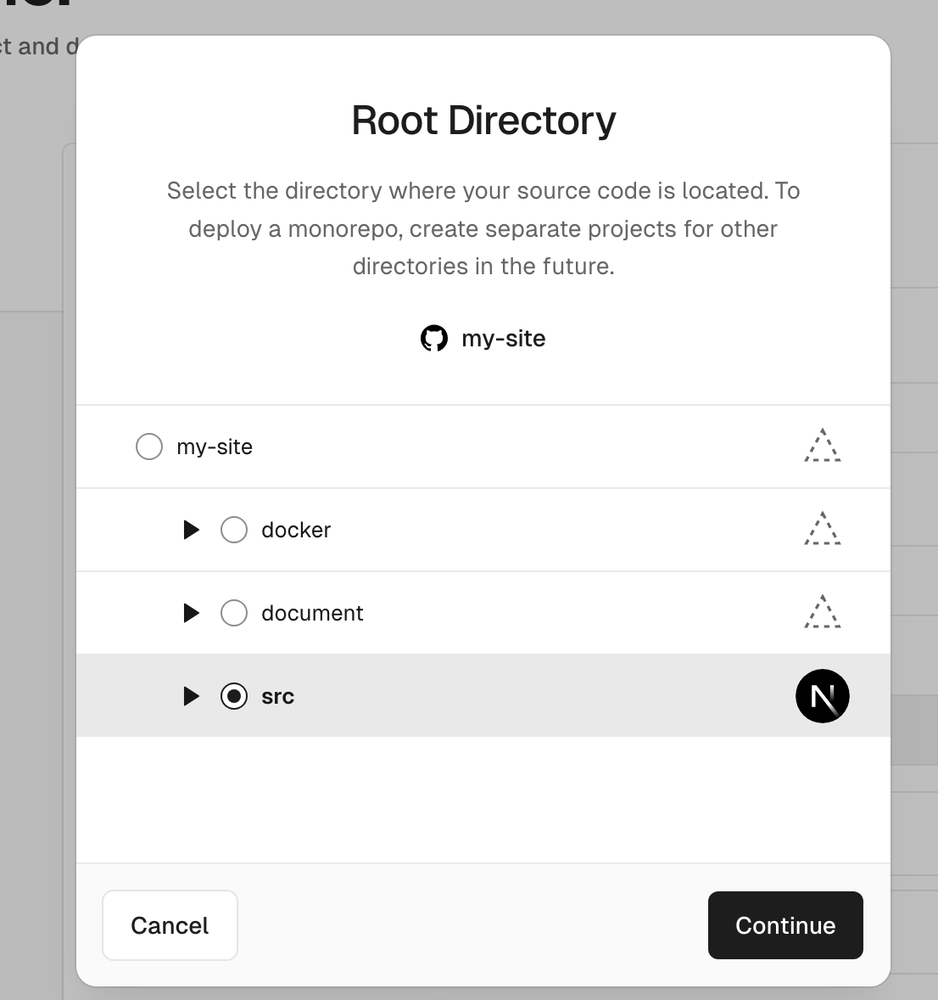
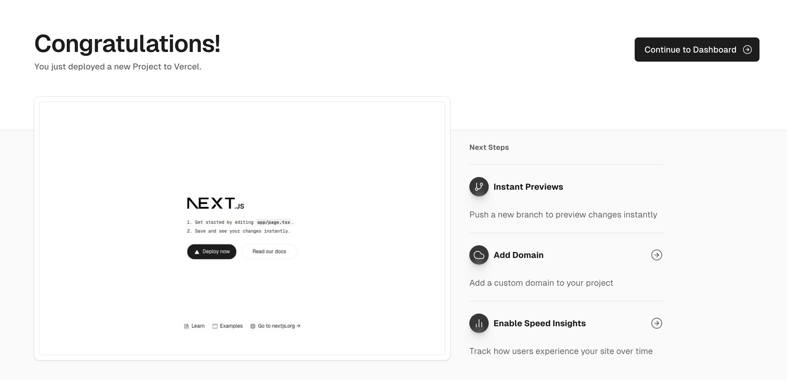
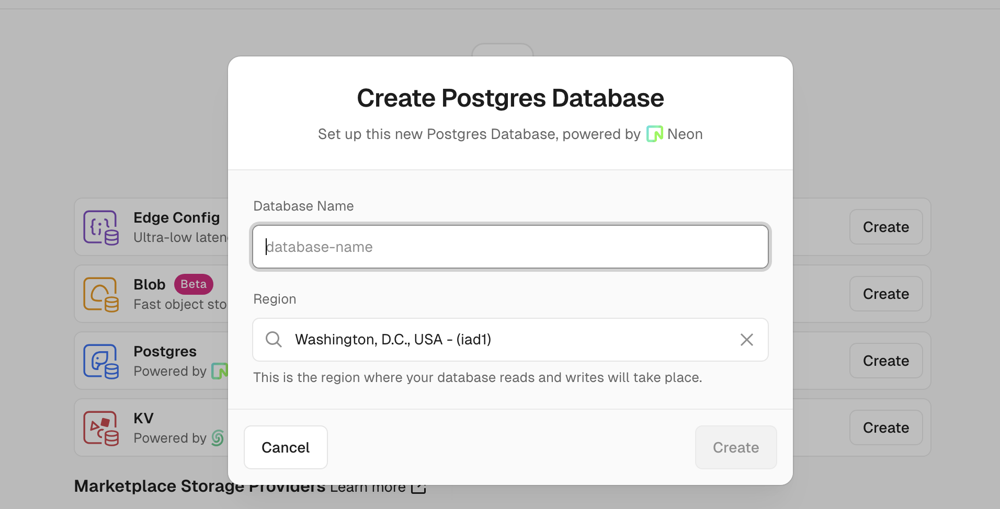
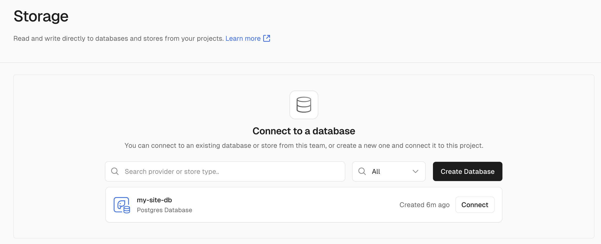
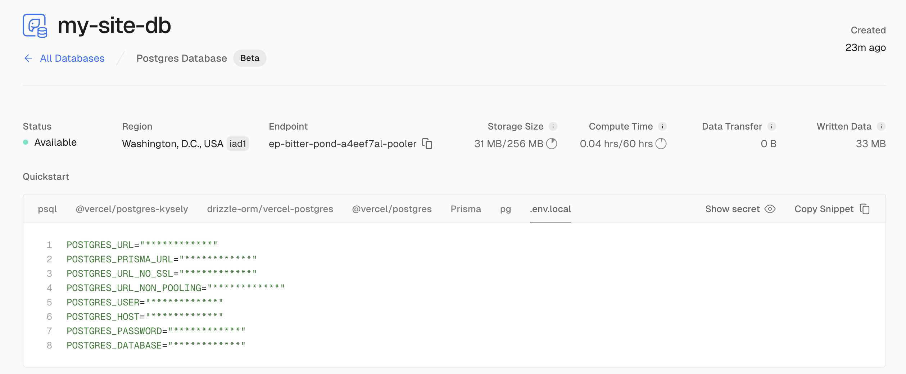

# Deploy on Vercel

## Create Account

Githubアカウントでvercelにアカウント作成

## Create Project

1. Add New...

    ||
    |:--:|

1. Project
1. リポイジトリをインポート

    ||
    |:--:|

1. Root Directoryにsrcを選択してContinue

    ||
    |:--:|

1. Deploy

1. Congratulations!

    ||
    |:--:|

1. strageタブを選択
1. Create Database
1. Postgresを選択

    ||
    |:--:|

1. Database Nameとregionを選択してCreate
1. Connect

    ||
    |:--:|

    ||
    |:--:|

1. ローカルにバーセルをインストール

    ```bash
    npm i -g vercel
    ```

1. Connect to a project

    ```bash
    cd src
    vercel link
    ```

    ```bash
    # 実行画面
    y_igarashi@cdm230046 my-site % cd src
    y_igarashi@cdm230046 src % vercel link
    vercel link
    Vercel CLI 37.9.0
    ? Set up “~/LocalRepository/my-site/src”? yes
    ? Which scope should contain your project? rashii's projects
    ? Link to existing project? no
    ? What’s your project’s name? my-site-src
    ? In which directory is your code located? ./
    Local settings detected in vercel.json:
    Auto-detected Project Settings (Next.js):
    - Build Command: next build
    - Development Command: next dev --port $PORT
    - Install Command: `yarn install`, `pnpm install`, `npm install`, or `bun install`
    - Output Directory: Next.js default
    ? Want to modify these settings? no
    ✅  Linked to rashiis-projects/my-site-src (created .vercel)
    y_igarashi@cdm230046 src % 
    ```

1. Pull your latest environment variables

    ```bash
    cd src
    vercel env pull .env.development.local
    ```

    ```bash
    # 実行画面
    y_igarashi@cdm230046 src % vercel env pull .env.development.local
    Vercel CLI 37.9.0
    > Downloading `development` Environment Variables for rashiis-projects/my-site-src
    ✅  Created .env.development.local file  [161ms]
    y_igarashi@cdm230046 src % 
    ```

1. Install our package

    ```bash
    yarn add @vercel/postgres
    ```

    ```bash
    # 実行画面
    y_igarashi@cdm230046 src % yarn add @vercel/postgres
    yarn add v1.22.22
    [1/4] 🔍  Resolving packages...
    [2/4] 🚚  Fetching packages...
    [3/4] 🔗  Linking dependencies...
    [4/4] 🔨  Building fresh packages...
    success Saved lockfile.
    success Saved 3 new dependencies.
    info Direct dependencies
    └─ @vercel/postgres@0.10.0
    info All dependencies
    ├─ @next/swc-darwin-arm64@14.2.15
    ├─ @vercel/postgres@0.10.0
    └─ fsevents@2.3.3
    ✨  Done in 111.30s.
    ```

1. .env.local

    ||
    |:--:|

1. Copy Snippet -> .env.development.localに貼り付け
